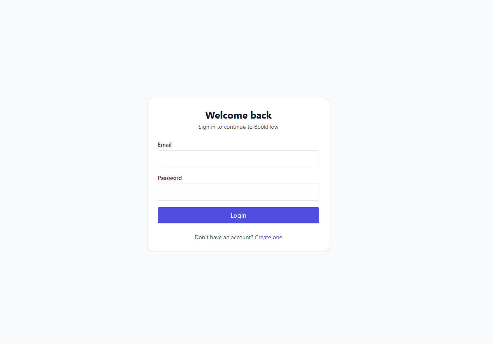
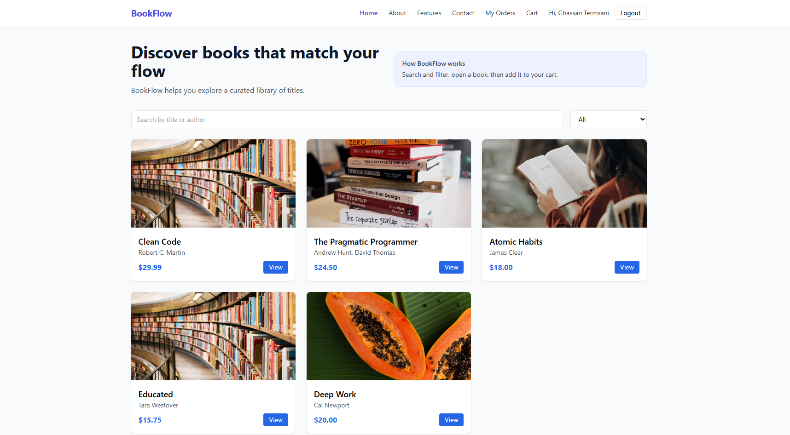

📚 BookFlow – Full-Stack Online Bookstore

BookFlow is a full-stack web application that allows users to browse books, manage a shopping cart, place orders, and view their order history.
It also includes an admin panel for managing the book catalog.

This project was developed as part of CSCI426: Advanced Web Programming
Department of Computer Science & Information Technology.

📝 Project Description

BookFlow is an online bookstore designed to simulate a real-world e-commerce experience.
Users can create an account, log in, explore a curated book catalog, add books to a cart, and place orders that are stored permanently in a database.

The system follows a clear client–server architecture:

A React frontend for the user interface

A Node.js + Express backend for business logic and APIs

A MySQL database for persistent data storage

✨ Features
👤 User Features

User registration and login

Browse books by category

Search books by title or author

View detailed book pages

Add books to a shopping cart

Place orders and view order history

Send messages through the Contact page

🛒 Cart & Orders

Cart is managed on the client side for fast interaction

Orders are stored permanently in the database

Each order is linked to the authenticated user

🔐 Authentication & Security

Protected routes (login required)

Session handling on the frontend

Admin access separated from normal users

🛠️ Admin Features

Admin login

Create, update, and delete books

Manage the book catalog dynamically

📱 UI & UX

Clean and responsive design

Optimized for desktop and mobile

Professional login and signup flow

🛠️ Technologies Used
Frontend:

-React.js

-React Router

-Axios

-Tailwind CSS

Backend:

-Node.js

-Express.js

-MySQL

-CORS

Tools:

-npm

-Git & GitHub

-Postman

-XAMPP (MySQL)

📦 Installation & Setup
✔️ Requirements:

Node.js v16+

npm

MySQL (via XAMPP )

🔑Admin Login

Admin access is separate from normal users.

📸 Screenshots

🔵 Login Page

🔵 Home Page

🔵 Book Details

🎓 Course Information

Course: CSCI426 – Advanced Web Programming

Department: Computer Science & Information Technology

Academic Year: 2025-2026

👤 Developer

Ghassan Termsani
Student – CSCI426

📌 Conclusion & Future Scope

BookFlow successfully demonstrates a complete full-stack web application using modern web technologies.
Future improvements may include:

Online payment integration

Email notifications

User reviews and ratings

Advanced admin analytics

© License

© 2025 BookFlow – Educational Project